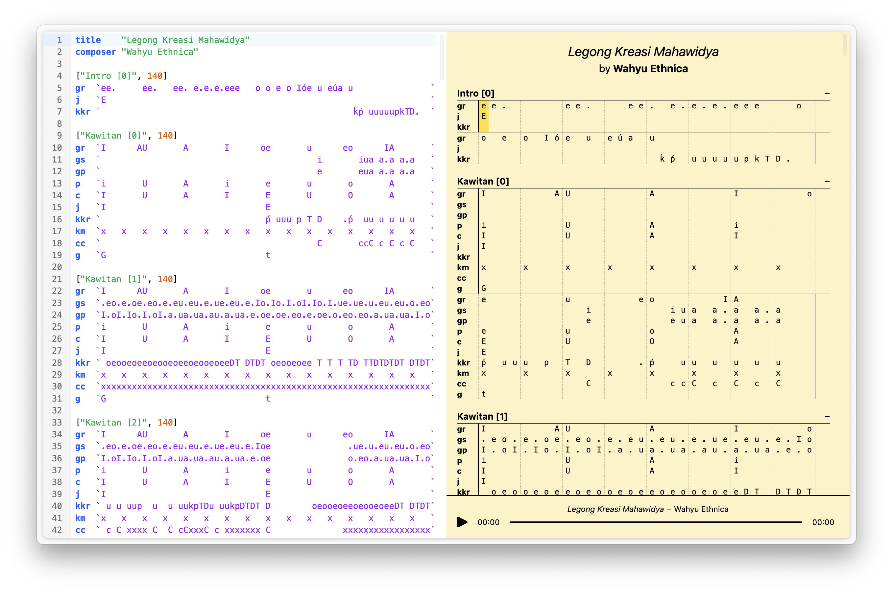

```text
Laras is a web-based gamelan score editor and player. The scores are defined using a custom markup language. This project is work in progress! More features will be added very soon:
- Documentation for the markup language.
- Support for more instruments.
- Possibility to import and export scores.
- Define repetitions within the score.
- Allow playback loops, speed control, and more.
...
```


